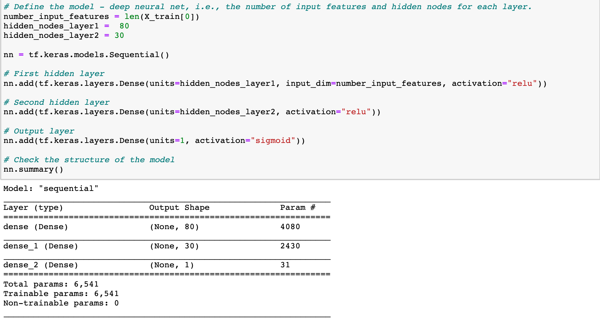
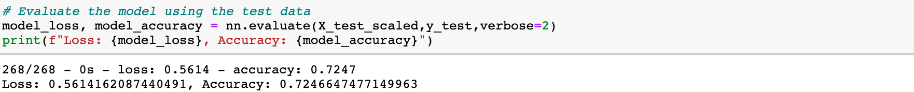
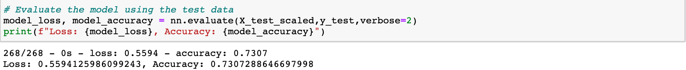
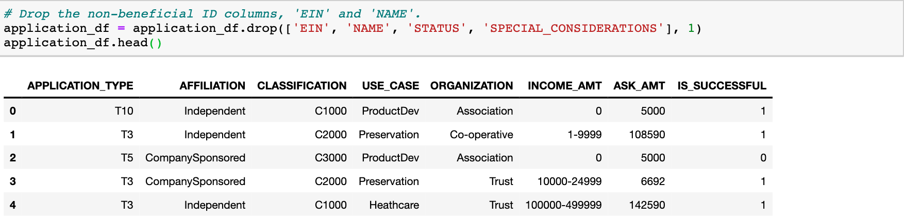
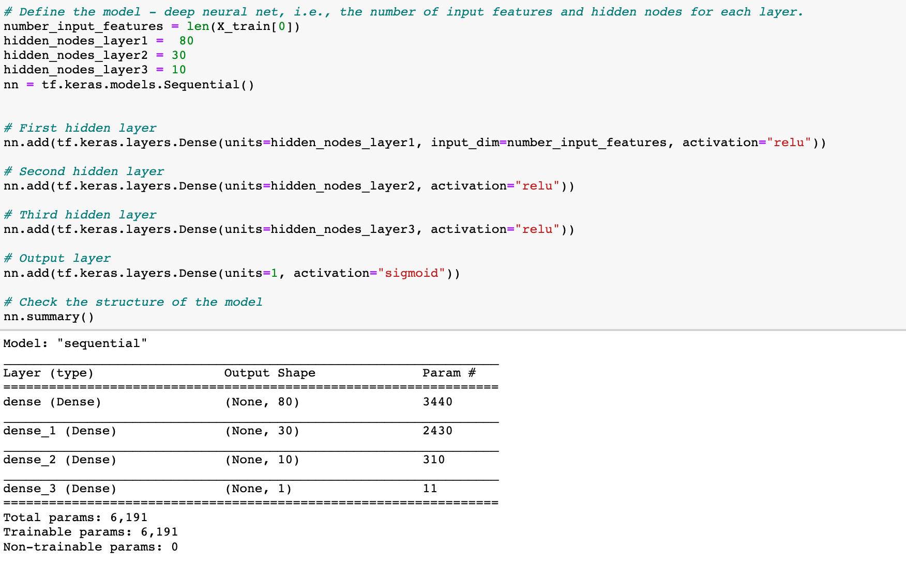
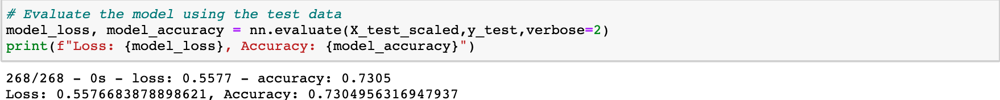
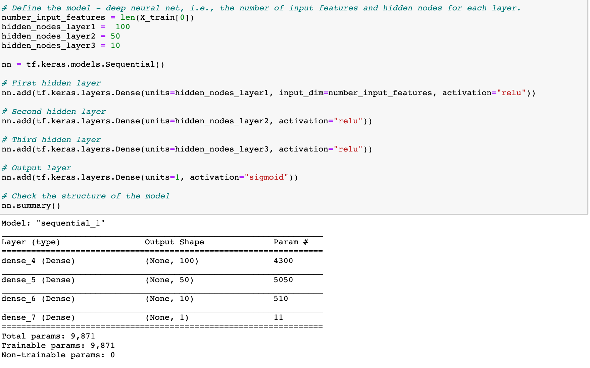
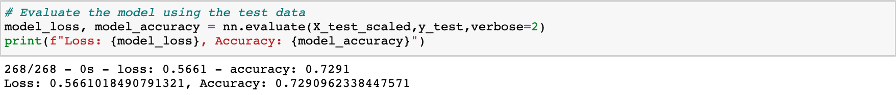

# Neural_Network_Charity_Analysis

## Overview of the analysis

The purpose of the analysis was to use knowledge of machine learning and neural networks and use the features in the provided dataset to create binary classifier that is capable of predicting whether applicants will be successful if funded by Alphabet Soup. Using a CSV containing more than 34,000 organizations that have received funding from Alphabet Soup over the years. The dataset contains a number of columns that capture metadata about each organization, such as the following:

- EIN and NAME—Identification columns

- APPLICATION_TYPE—Alphabet Soup application type

- AFFILIATION—Affiliated sector of industry

- CLASSIFICATION—Government organization classification

- USE_CASE—Use case for funding

- ORGANIZATION—Organization type

- STATUS—Active status

- INCOME_AMT—Income classification

- SPECIAL_CONSIDERATIONS—Special consideration for application

- ASK_AMT—Funding amount requested

- IS_SUCCESSFUL—Was the money used effective

## Results:
### Data Preprocessing:

- What variable(s) are considered the target(s) for your model?

    The variables considered the target for this model would if the be the IS_SUCESSFUL column.

- What variable(s) are considered to be the features for your model?

    The features for this model would include the Application Type, Affiliation, Classification Use Case, Organization, Status, Income Amout Special Considerations and Ask Amount.
    
- What variable(s) are neither targets nor features, and should be removed from the input data?

    EIN and Name are neither targets nor features and should be removed from the input data. They are both identifiers and do not provide any revelant informatiion.

### Compiling, Training, and Evaluating the Model:

- How many neurons, layers, and activation functions did you select for your neural network model, and why?

  In this model, there are three layers. There are 80 neurons in one hidden layer with ReLU activation function and 30 neurons in the second hidden layer with ReLU activation function. There is also an outer layer with the Sigmond activation function. These selections were chosen to generate a neural network model to increase the model performance accuracy.

- Were you able to achieve the target model performance?

    I was able able to ahcieve a higher model performance from 72.4% to 73.07% but unforunately I was not able to achiever the target model performance of 75%.

Orginal:

Highest Optimization:

- What steps did you take to try and increase model performance?

    I tried to 3 attempts to modify the original model to increase model performance. I dropped the EIN, NAME, Status, and Special Considerations columns. 

For Attempt 1,  I added an extra hidden layers with 10 neurons with a ReLu Activation function. The Accuracy Model Performacne was 73.049%.

Optimization #1

For Attempt 2, I increased the neurons from 80 to 100 in the hidden layer #1 and from 30 to 50 neurons in the hidden layer #2. The Accuracy Model Performacne was 73.072%.

Optimization #2

For Attempt 3, I increased the neurons from 100 to 120 in the hidden layer #1 and from 50 to 60 neurons in the hidden layer #2. The Accuracy Model Performacne was 72.909%.

Optimization #3

## Summary:

The target model performance was to aim at 75% accuracy. With the three optimization attempts, the model performance accuracy went from 72.4% to 73.07%. I increased one additional hidden layer to each attempt and increased the number of neurons each optimization attempt. It did not meet the target model performance.

One recommendation for how another model could increase the model accuracy performance would use the Random Forest Classifier. Random Forest Classifier is highly accurate, and it does not suffer from the overfitting problem.